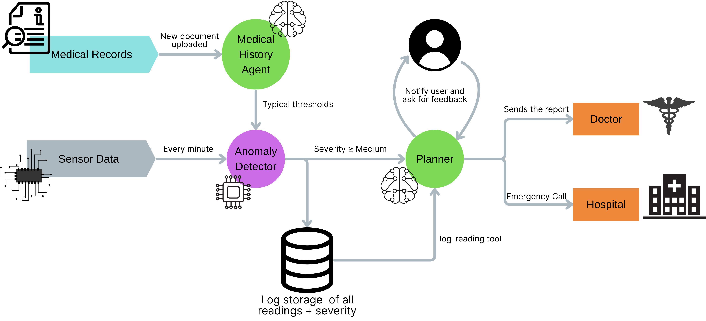

# CARE - Chronic-condition Agents for Real-time Evaluation
This project showcases a small **agentic AI system** for chronic-condition monitoring, built with **LangGraph** and **LangChain**.


It currently simulates a glucose-monitoring scenario, but the architecture is general enough to extend to other chronic diseases and signals.

# Competition Result

This project earned second place at the **Reply Student Clash 2025 – Politecnico di Torino Tech Challenge**, part of the pan-European Reply Clash event series held across multiple universities in November 2025.
The competition focused on agentic AI. Teams built deployable AI-agent systems under time and resource constraints.
More than a thousand students participated across Europe.
The scoring combined live project evaluations, case-study submissions, generative-AI tasks, and event-based challenges.
Final rankings for each site were determined by technical quality, clarity of agent design, and applied impact.
This system placed second within the Politecnico di Torino event after evaluation by Reply professionals across both the technical domain.

## Overview

The system is implemented in `main_demo.py` and is organized as a **graph of agents/nodes**:

1. **Baseline Agent (LLM)**  
   Reads a mock medical record from `medicalrecord.txt` and uses an LLM (OpenAI) to extract the patient’s **baseline glucose** (mg/dL).  
   The value is stored in the shared state as `baseline` and `baseline_from_record`.

2. **Sensor Node (Mock Sensor)**  
   Emits a predefined sequence of glucose readings:

   ```python
   PREDEFINED_READINGS = [80, 85, 90, 110, 150, 200, 75, 95]
   ```

   It simulates time passing between readings using `time.sleep(...)`.

3. **RNN Node (Rule-based Classifier)**  
   A simple rule-based stand-in for an RNN/model that classifies each reading vs baseline into one of:

   ```python
   severity in {"normal", "low", "medium", "high"}
   ```

   Classification is based on the percentage deviation from the baseline.

4. **Logger Node**  
   Logs each reading with timestamp, severity, and baseline to `glucose_log.txt`, for example:

   ```text
   2025-11-22T15:02:16.280134	reading=95.0	severity=normal	baseline=100.0
   ```

   It also keeps the last N log lines in `recent_logs` inside the state so the care agent can use them.

5. **Severity Router**  
   Decides what to do after each logged reading:

   - `normal` or `low`  
     Only updates the log and continues monitoring.  
     For `low`, waits a few seconds before going back to the sensor.

   - `medium` or `high`  
     Forwards the state to the care agent.

6. **Care Agent (LLM + Tools, Multi-turn)**  
   Invoked only when severity is `medium` or `high`.

   It has access to mock tools:

   - `getClinicalInformations()` – returns static clinical information for the user.  
   - `notifyuser(severity, message)` – prints a message and reads a simulated user response from the keyboard.  
   - `emergencyCall(message)` – simulates an emergency call and returns a mock response.  
   - `notifyDoctor(message)` – prints a formatted “report” for the doctor.

   The care agent works in **multiple turns**:

   - Each turn, it sees:
     - current reading, severity, and baseline,
     - recent logs (`recent_logs`),
     - previous interaction steps stored in `care_history`.

   - It asks the LLM to return a **JSON** plan:

     ```json
     {
       "actions": [
         {"tool": "notifyuser", "message": "..."},
         {"tool": "emergencyCall", "message": "..."},
         {"tool": "notifyDoctor", "message": "..."}
       ]
     }
     ```

   - The code parses this JSON and executes each action:
     - For `notifyuser`, it asks for a simulated user reply and appends both the message and response to `care_history`.
     - For `emergencyCall` and `notifyDoctor`, it simulates the respective side effects and logs them into `care_history`.

   - Then it calls the LLM again with the updated `care_history` so the agent can reason about the latest user feedback and plan the **next** actions.

   - The loop continues until:
     - the LLM returns an empty list of actions (`{"actions": []}`), or
     - a safety limit on the number of executed actions is reached.

Overall pipeline:

```text
baseline_agent -> sensor -> rnn -> logger -> router -> (sensor | care_agent)
                                                   \
                                                    -> care_agent -> sensor
```

---

## Files

- `main_demo.py`  
  Main LangGraph demo: defines the shared state, all nodes/agents, mock tools, and the demo runner.

- `glucose_log.txt`  
  Generated log of readings, severities, and baseline over time (your sample log is in this file).

- `medicalrecord.txt`  
  Mock medical record from which the baseline glucose is extracted using the baseline agent.

- `requirements.txt`  
  Python dependency list for this demo.

---

## Requirements

- **Python** 3.9+  
  (for `TypedDict`, `Literal`, and f-strings).

- **OpenAI API key**  
  Used by the baseline agent and the care agent via `langchain-openai`.

Python packages (see `requirements.txt`):

- `langgraph`
- `langchain-core`
- `langchain-openai`
- `python-dotenv`

---

## Setup

From the project directory:

```bash
cd "C:\Users\giuli\OneDrive - Politecnico di Torino\Desktop\UNIS\POLITO\reply"
python -m venv .venv
".venv\Scripts\activate"
pip install -r requirements.txt
```

### Environment variables

Create a `.env` file in the project root with your OpenAI key:

```env
OPENAI_API_KEY=sk-...
```

### Mock medical record

Create a `medicalrecord.txt` file, for example:

```text
The patient reports a baseline fasting glucose of about 100 mg/dL, with occasional spikes after meals.
```

---

## Running the demo

With the virtual environment activated and the `.env` + `medicalrecord.txt` in place:

```bash
python main_demo.py
```

What you will see in the console:

- Baseline extraction via LLM (`[BASELINE-LLM]` and `[BASELINE]` logs).
- Continuous cycles of:
  - `[SENSOR]` new readings,
  - `[RNN]` severity classification,
  - `[LOGGER]` lines written to `glucose_log.txt`,
  - `[ROUTER]` decisions.
- When severity is `medium` or `high`:
  - `[CARE]` logs with LLM JSON output and multi-turn reasoning,
  - `[TOOL notifyuser]` prompts asking for a mocked user response,
  - possible `[TOOL emergencyCall]` and `[TOOL notifyDoctor]` actions.

The file `glucose_log.txt` will be continuously appended with new entries similar to the ones in your sample.

---

## Extending the project

This demo is intentionally small but designed to be extended:

- Replace the rule-based classifier with a learned model.
- Swap the mock sensor for a real device or streaming data.
- Generalize from glucose to other chronic-condition indicators (blood pressure, weight, heart rate, sleep, etc.).
- Integrate a real messaging/notification channel instead of console I/O.
- Replace the mock tools with real services (EHR integration, email to doctor, telemedicine alerts).

